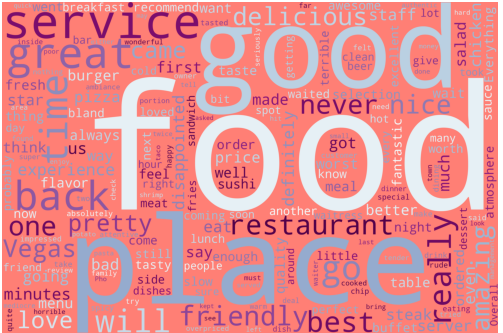
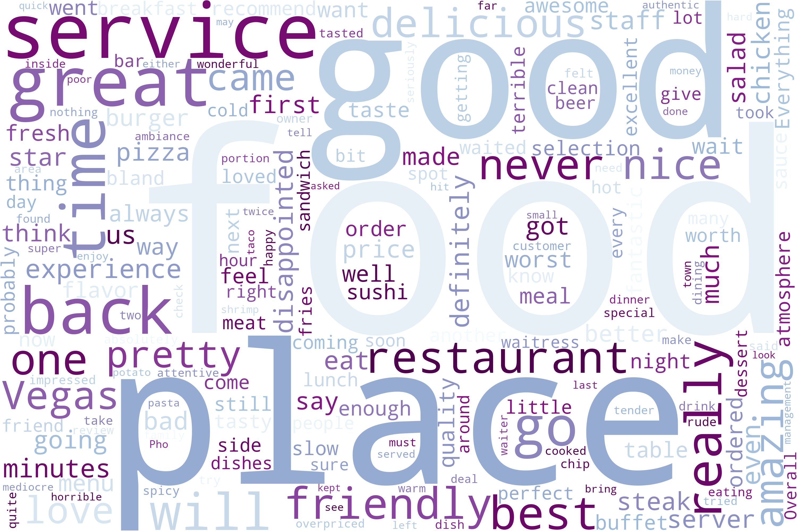

## Table of contents

- [Overview](#overview)
  - [Screenshot](#screenshot)
  - [Built with](#built-with)
  - [What I learned](#what-i-learned)

## Overview
Word Cloud
The word cloud is a visual representation of text data, where the size and color of the words are related to their frequency of occurrence in the text. The word cloud is a type of data visualization that can be used to represent the frequency of words in a text, and it is often used in information visualization and data mining. 

### Screenshot

## My process

### Built with
- Matplotlib
- World Cloud library

## what-i-learned
- How to use the World Cloud library to create a word cloud
- How to use Matplotlib to display the word cloud
- How to customize the appearance of the word cloud

  

